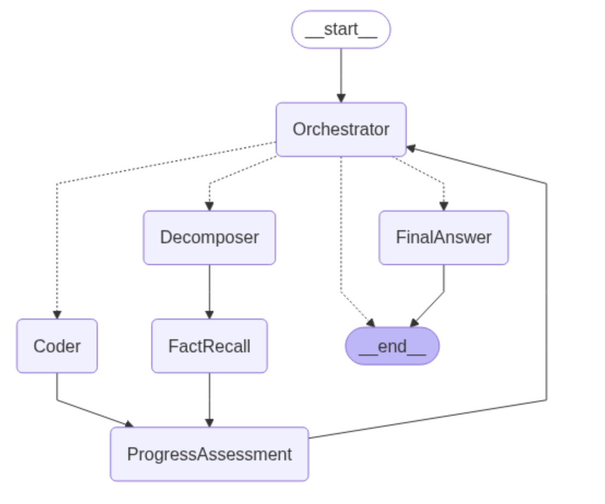

# Multi-Hop Reasoning Agent

A sophisticated AI agent system that uses multi-step reasoning to answer complex questions requiring information from multiple sources and logical steps.

## Live Demo

Try the agent now: **[https://multi-hop-agent.streamlit.app/](https://multi-hop-agent.streamlit.app/)**

## Architecture

The Multi-Hop Reasoning Agent employs a distributed agent architecture where specialized agents collaborate to solve complex reasoning tasks:



### Core Components

#### **Orchestrator**
The central decision-maker that routes tasks to appropriate specialized agents based on the current state and available information.

- **Purpose**: Policy router and coordinator
- **Decisions**: `DECOMPOSE`, `ASK_CODER`, or `FINAL_ANSWER`
- **Logic**: Analyzes task progress and determines next steps

#### **Decomposer** 
Breaks down complex questions into atomic, answerable sub-questions.

- **Input**: Complex multi-hop questions
- **Output**: Single atomic sub-question
- **Strategy**: Identifies missing information and creates targeted queries

#### **FactRecall**
Answers factual sub-questions using its knowledge base.

- **Specialization**: Factual information retrieval
- **Input**: Atomic sub-questions from Decomposer
- **Output**: Factual answers and evidence

#### **Coder**
Executes computational tasks, calculations, and code-based analysis.

- **Capabilities**: Mathematical calculations, data processing, algorithmic solutions
- **Input**: Clear instructions with necessary facts
- **Output**: Computational results and analysis

#### **FinalAnswer**
Synthesizes information from all previous steps into a comprehensive final answer.

- **Role**: Information synthesis and response generation
- **Input**: All collected facts and sub-answers
- **Output**: Complete, well-reasoned final answer

#### **ProgressAssessment**
Monitors the reasoning process and detects when the system gets stuck.

- **Function**: Progress tracking and stall detection
- **Logic**: Evaluates whether recent steps advanced toward the goal
- **Safety**: Prevents infinite loops and guides recovery

## Key Features

### **Multi-Hop Reasoning**
- Handles questions requiring multiple logical steps
- Automatically decomposes complex queries into manageable sub-problems
- Maintains context across reasoning steps

### **Robust Error Handling**
- Stall detection and recovery mechanisms
- Progress tracking to avoid infinite loops
- Graceful fallback to partial answers when needed

### **Real-time Processing**
- Live execution tracking through Streamlit interface
- Step-by-step progress visualization
- Interactive parameter adjustment (temperature, top-p, top-k)

### **Configurable Parameters**
- **Temperature**: Controls response randomness (0.0-2.0)
- **Top-p**: Nucleus sampling parameter (0.0-1.0) 
- **Top-k**: Vocabulary limitation (1-100)

## Getting Started

### Prerequisites

- Python 3.8+
- Google Cloud Platform account with Vertex AI enabled
- Google Cloud service account credentials

### Installation

1. **Clone the repository**
   ```bash
   git clone https://github.com/dhruvmadhwal/multi-hop-agent.git
   cd multi-hop-agent
   ```

2. **Install dependencies**
   ```bash
   pip install -r app/requirements.txt
   ```

3. **Set up Google Cloud credentials**
   - Create a service account in Google Cloud Console
   - Download the JSON credentials file
   - Set up authentication (see Configuration section)

### Configuration

#### For Local Development
Set up environment variables or use a `.env` file:

```bash
export GOOGLE_APPLICATION_CREDENTIALS="path/to/your/service-account.json"
export GOOGLE_CLOUD_PROJECT="your-project-id"
export GOOGLE_CLOUD_LOCATION="region"
```

## Usage

### Command Line Interface

```python
from multi_hop_agent.runner import run_agent_on_prompt

# Run a single question
result = run_agent_on_prompt(
    task="What is the batting hand of each of the first five picks in the 1998 MLB draft?",
    temperature=0.1,
    top_p=0.95,
    top_k=40
)

print(result['reply'])  # Final answer
print(result['answered_questions'])  # Sub-questions and answers
```

## Technical Architecture

### State Management

The system uses a shared `AgentState` that tracks:

```python
class AgentState(TypedDict):
    task: str                           # Original user question
    answered_questions: Dict[str, str]  # Sub-Q&A pairs
    log: List[str]                      # Execution history
    progress_tracker: Dict[str, Any]    # Progress monitoring
    coder_code: Optional[str]           # Code execution results
    # ... additional state fields
```

### Agent Graph Structure

Built using LangGraph, the system creates a stateful workflow:

```python
def build_agent_graph(llm):
    graph_builder = StateGraph(AgentState)
    
    # Add specialized agent nodes
    graph_builder.add_node("Orchestrator", orchestrator_node)
    graph_builder.add_node("Decomposer", decomposer_node)
    graph_builder.add_node("FactRecall", fact_recall_node)
    # ... other nodes
    
    # Define routing logic
    graph_builder.add_conditional_edges(
        "Orchestrator", 
        route_based_on_decision
    )
    
    return graph_builder.compile()
```

### LLM Integration

Uses Google's Gemini models through Vertex AI:

- **Default Model**: `gemini-2.5-flash`
- **Structured Output**: Pydantic models for reliable parsing
- **Error Handling**: Robust fallbacks for parsing failures

## Performance & Benchmarks

The agent has been tested on:

- **FanoutQA**: Multi-entity reasoning questions
- **Frames**: Literary and cultural reference questions  
- **Musique**: Geographic and factual reasoning chains

### Typical Performance Metrics

- **Average Reasoning Steps**: 3-7 per question
- **Success Rate**: High accuracy on well-formed questions
- **Processing Time**: 30-120 seconds depending on complexity

## Development

### Project Structure

```
Multi-Hop-Agent/
├── multi_hop_agent/
│   ├── agents/           # Specialized agent implementations
│   │   ├── orchestrator.py
│   │   ├── decomposer.py
│   │   ├── fact_recall.py
│   │   ├── coder.py
│   │   ├── final_answer.py
│   │   └── progress_assessment.py
│   ├── config/           # Configuration and settings
│   │   └── settings.py
│   ├── graph/            # Agent graph construction
│   │   └── agent_graph.py
│   ├── models/           # Pydantic schemas and state definitions
│   │   └── schema.py
│   ├── prompts/          # System prompts for each agent
│   │   └── system_prompts.py
│   ├── utils/            # Helper functions and LLM utilities
│   │   ├── llm.py
│   │   └── helpers.py
│   └── runner.py         # Main execution runner
├── app/
│   ├── streamlit_app.py  # Streamlit web interface
│   └── requirements.txt  # Dependencies
├── assets/
│   └── architecture-diagram.png
└── README.md
```

### Adding New Agents

1. Create agent implementation in `agents/`
2. Define output schema in `models/schema.py`
3. Add system prompt in `prompts/system_prompts.py`
4. Register in `graph/agent_graph.py`

### Extending Functionality

The modular architecture allows easy extension:

- **New reasoning strategies** → Add agent types
- **Different LLM backends** → Modify `utils/llm.py`
- **Enhanced UIs** → Build on the Streamlit foundation

---

